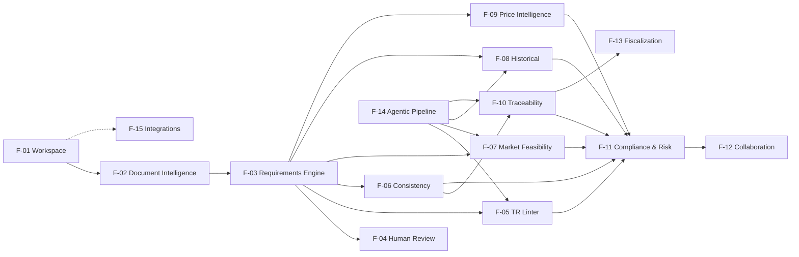

# Product Spec — TR Intelligence Platform

**Status:** Draft v0.1  
**Escopo:** produto completo, cobrindo a fase preparatória até execução/fiscalização da contratação.  
**Perfil inicial e exclusivo desta versão:** `PUBLICO_14133_PREGAO_ELETRONICO_BENS` — ente municipal, Lei 14.133/2021, pregão eletrônico e aquisição de bens comuns.  
**Princípio central:** a ferramenta não substitui decisão administrativa, jurídica ou técnica. Ela estrutura evidências, detecta inconsistências e reduz trabalho mecânico.

Este arquivo, com `01`–`04` e o [README](README.md), é a fonte de verdade do produto. A ordem de construção é M0–M6 em `04_TRACEABILITY_MATRIX.md`. `scope.md` e `Plano.md` recortam a fatia atual; não redefinem o produto.

---

## 1. Visão do produto

A plataforma mantém uma **representação estruturada e rastreável da contratação** ao longo do ciclo:

`Necessidade → ETP → TR → Mercado → Edital → Contrato → Fiscalização`

O documento deixa de ser a única fonte de verdade. A contratação passa a possuir um modelo interno de:

- itens;
- requisitos;
- quantidades;
- unidades;
- prazos;
- garantias;
- critérios de aceitação;
- obrigações;
- fontes;
- decisões;
- alterações;
- findings;
- evidências.

Cada valor estruturado deve possuir **proveniência**: documento, página/seção, trecho original e versão.

### 1.1 Escopo suportado nesta versão

Um processo só é `SUPPORTED` quando satisfaz cumulativamente o perfil `PUBLICO_14133_PREGAO_ELETRONICO_BENS`:

- órgão ou entidade de qualquer esfera (federal, estadual, distrital ou municipal);
- regência pela Lei 14.133/2021;
- modalidade pregão, em forma eletrônica;
- objeto de aquisição de bens comuns.

Processos federais, estaduais ou distritais são `OUT_OF_SCOPE` e não podem alimentar engines, contagens, corpus de avaliação nem comparáveis públicos. PNCP e Compras.gov são canais de obtenção/publicação de dados; o canal, isoladamente, não define a esfera do processo nem o torna federal ou municipal.

IN SEGES/ME nº 81 e modelos da AGU são fontes `REFERENCE_ONLY` neste perfil: podem apoiar explicações e revisão humana, mas não determinar `SUPPORTED` nem originar finding normativo. Apenas regras `NORMATIVE` aplicáveis ao perfil ativo podem fazê-lo.

Os contratos canônicos e o gate obrigatório de escopo são definidos em `01_REQUIREMENTS.md`. Outros perfis poderão ser incorporados em versões futuras, mas nenhum outro ente é aceito nesta versão.

---

## 2. Perfis de usuário

| ID | Perfil | Responsabilidade principal |
|---|---|---|
| P-01 | Área requisitante municipal | Formalizar necessidade e validar requisitos |
| P-02 | Planejamento da contratação municipal | ETP, TR, pesquisa de mercado e consolidação |
| P-03 | Compras/Licitações municipal | Preparar edital e conduzir passagem para fase externa |
| P-04 | Jurídico/Controle interno municipal | Revisar legalidade, coerência e riscos |
| P-05 | Gestor/Fiscal municipal de contrato | Acompanhar execução e recebimento |
| P-06 | Administrador municipal | Configurar órgão/entidade, regras, integrações e perfis suportados |

---

## 3. Mapa de features

### F-01 — Workspace da contratação
Um workspace único para todos os documentos, dados estruturados, findings, histórico e ações relativos a uma contratação.

O workspace registra, no mínimo, CNPJ e identificação do órgão/entidade, esfera, regime legal, modalidade, forma, natureza do objeto, perfil e estado de escopo. Nasce em `SCOPE_VALIDATION` e só habilita processamento de domínio após o gate FR-006 produzir `SUPPORTED`; `OUT_OF_SCOPE` permanece registrado e auditável, sem alimentar engines, contagens, corpus ou comparáveis públicos.

**Depende de:** nenhuma.  
**Habilita:** todas as demais features após FR-006.

### F-02 — Document Intelligence
Ingestão e classificação de ETP, TR, edital, contrato, DFD, pesquisa de preços e anexos.

Deve:
- aceitar PDF e DOCX;
- identificar tipo documental;
- preservar o arquivo original imutável e, separadamente, página, seção, tabela e texto extraído;
- calcular SHA-256 do original e detectar duplicatas por esse hash;
- executar OCR quando necessário, de forma idempotente para o mesmo SHA-256 e a mesma versão do pipeline;
- registrar versão, hash e derivados de parsing/OCR sem sobrescrever o original;
- permitir reprocessamento versionado.

**Depende de:** F-01.  
**Habilita:** F-03, F-05, F-06, F-10.

### F-03 — Requirements Engine
Extrai informação estruturada dos documentos.

Entidades mínimas:
- `Item`
- `Requirement`
- `Quantity`
- `Deadline`
- `Warranty`
- `AcceptanceCriterion`
- `Obligation`
- `PaymentCondition`
- `Evidence`

No persistido, `Quantity` / `Deadline` / `Warranty` são `FieldValue`; `AcceptanceCriterion` / `Obligation` / `PaymentCondition` são `Requirement` categorizados até haver tipos próprios. Todo valor estruturado tem estado de revisão (`EXTRACTED` → `CONFIRMED` | `REJECTED`) e proveniência. A engine só processa workspace `SUPPORTED`; conteúdo `OUT_OF_SCOPE` pode ser preservado para auditoria do gate, mas não entra em extrações de domínio nem em resultados agregados.

Exemplo:

```json
{
  "item_id": "ITEM-001",
  "attribute": "ram",
  "operator": ">=",
  "value": 16,
  "unit": "GB",
  "source": {
    "document": "TR",
    "section": "5.2.1",
    "page": 8
  }
}
```

**Depende de:** F-02.  
**Habilita:** F-04, F-05, F-06, F-07, F-08, F-09, F-10, F-13.

### F-04 — Human Review
Tela para confirmar, editar ou rejeitar extrações.

Cada mudança deve registrar:
- usuário;
- timestamp;
- valor anterior;
- valor posterior;
- justificativa opcional/obrigatória conforme regra.

**Depende de:** F-03.  
**Habilita:** dados confiáveis para todo o pipeline.

### F-05 — TR Quality Linter [B]
Revisa qualidade interna do TR.

Subfeatures:
- F-05.1 completude estrutural;
- F-05.2 ambiguidade;
- F-05.3 subjetividade;
- F-05.4 mensurabilidade;
- F-05.5 contradições internas;
- F-05.6 obrigação sem critério de aceitação;
- F-05.7 referência/anexo inexistente;
- F-05.8 requisito possivelmente restritivo sem justificativa localizada.

Cada finding deve possuir:
- regra e sua fonte (`NORMATIVE` ou `REFERENCE_ONLY`);
- severidade;
- confiança;
- trecho;
- explicação;
- evidência;
- ação recomendada;
- status.

Fontes `REFERENCE_ONLY`, inclusive IN SEGES/ME nº 81 e modelos AGU, podem ser exibidas como apoio, mas não geram finding normativo. O linter roda somente para workspace `SUPPORTED` e usa como norma apenas regra `NORMATIVE` aplicável ao perfil ativo.

**Depende de:** F-02, F-03.  
**Relaciona-se com:** F-07, F-10, F-11.

### F-06 — Consistency Engine [C]
Compara documentos do mesmo processo.

Comparações principais:
- ETP ↔ TR;
- TR ↔ edital;
- edital ↔ contrato;
- TR ↔ contrato;
- DFD ↔ ETP quando disponível.

Campos iniciais:
- objeto;
- item;
- quantidade;
- unidade;
- prazo;
- garantia;
- especificação;
- local de entrega;
- critérios de aceitação;
- obrigações.

As comparações usam apenas documentos ativos/utilizáveis de workspace `SUPPORTED`. Documentos ou processos `OUT_OF_SCOPE` não participam de pares, baseline ou contagens.

**Depende de:** F-03, F-04.  
**Habilita:** F-10, F-11, F-13.

### F-07 — Market Feasibility [A]
Verifica se a especificação corresponde ao mercado atual.

Deve:
- buscar candidatos;
- extrair atributos dos produtos;
- normalizar modelos;
- calcular compatibilidade por requisito;
- calcular compatibilidade conjunta;
- identificar requisitos com maior impacto restritivo;
- mostrar evidência das correspondências.

Saída exemplo:

```text
143 produtos analisados
16 GB RAM         → 81% compatíveis
SSD >= 512 GB     → 92%
peso <= 1,3 kg    → 11%
bateria >= 70 Wh  → 7%
todos             → 1,4%
```

**Depende de:** F-03.  
**Relaciona-se com:** F-05.8, F-08, F-09.

### F-08 — Historical Lineage & Obsolescence [D]
Identifica reutilização de especificações e evolução histórica.

Deve:
- localizar TRs/itens similares apenas entre processos municipais `SUPPORTED`;
- estimar similaridade;
- reconstruir linhagem provável sem atravessar registros `OUT_OF_SCOPE`;
- mostrar primeira ocorrência conhecida no universo suportado;
- comparar disponibilidade de mercado ao longo do tempo;
- detectar especificações possivelmente obsoletas.

Processos federais, estaduais ou distritais nunca compõem a base histórica, os denominadores ou as contagens.

**Depende de:** F-03 + base histórica filtrada pelo escopo.  
**Relaciona-se com:** F-07, F-09.

### F-09 — Price Intelligence [A]
Pesquisa e estrutura preços comparáveis.

Fontes podem incluir:
- contratações públicas municipais semelhantes e `SUPPORTED`;
- bases oficiais, após classificação do escopo de cada comparável;
- fornecedores;
- comércio eletrônico quando aplicável ao perfil normativo.

Deve:
- normalizar unidades;
- resolver equivalência de itens;
- registrar fonte/data, esfera e decisão do gate;
- excluir processos `OUT_OF_SCOPE` antes de amostra, estatísticas e denominadores;
- identificar outliers;
- produzir média, mediana e intervalo;
- manter memória de cálculo e das exclusões de escopo.

PNCP/Compras.gov podem fornecer dados, mas não qualificam a esfera: nenhum registro público entra como comparável sem validação municipal e dos demais critérios do perfil.

**Depende de:** F-03.  
**Relaciona-se com:** F-07, F-08.

### F-10 — Requirement Traceability [C]
Constrói a cadeia de vida de cada requisito.

Exemplo:

`DFD → ETP §7.3 → TR §5.2 → Edital §8.1 → Contrato §11 → Checklist de fiscalização`

Detecta:
- requisito sem origem;
- requisito omitido posteriormente;
- alteração sem justificativa;
- obrigação sem mecanismo de medição;
- obrigação contratual sem item de fiscalização.

**Depende de:** F-03, F-06.  
**Relaciona-se com:** F-13.

### F-11 — Compliance & Risk Engine
Unifica findings de regras determinísticas, semânticas, históricas e de mercado.

Categorias:
- estrutura;
- consistência;
- mercado;
- histórico;
- preço;
- execução;
- compliance.

Todo finding deve ser auditável e identificar `Rule.source_type`. Fonte `REFERENCE_ONLY` não pode, sozinha ou combinada, produzir finding normativo, elevar sua severidade por suposta obrigação ou determinar suporte de escopo.

**Depende de:** F-05, F-06; pode incorporar F-07, F-08, F-09, F-10.

### F-12 — Collaboration & Audit
Workflow dos findings.

Estados mínimos:

`OPEN → UNDER_REVIEW → RESOLVED | ACCEPTED_RISK | FALSE_POSITIVE`

Deve registrar:
- responsável;
- comentário;
- evidência;
- decisão;
- histórico.

**Depende de:** F-11.

### F-13 — Contract Execution & Fiscalization
Converte requisitos contratuais em itens verificáveis de acompanhamento.

Deve:
- gerar checklist de recebimento;
- acompanhar prazo;
- associar evidências de entrega;
- registrar conformidade/não conformidade;
- manter vínculo com requisito original.

**Depende de:** F-03, F-10.

### F-14 — Orchestration / Agentic Pipeline
Camada interna responsável por executar tarefas complexas.

Agentes possíveis:
- `EvidenceFinder`;
- `MarketResearchAgent`;
- `HistoricalResearchAgent`;
- `TraceabilityAgent`;
- `FindingValidator`.

Regra arquitetural:
- o gate de escopo determinístico antecede qualquer agente;
- agentes recebem apenas workspaces e corpora `SUPPORTED`, e ferramentas de busca devem aplicar o mesmo filtro antes de recuperar contexto;
- código determinístico para comparação objetiva;
- LLM para interpretação semântica;
- agente apenas quando houver busca/iteração/tool-use;
- toda conclusão deve retornar estrutura + evidência e não pode usar fonte `REFERENCE_ONLY` como base de conclusão normativa.

**Depende de:** F-02/F-03 e ferramentas externas.

### F-15 — Integrations & Export
Integrações com:
- sistemas municipais de processo eletrônico;
- TR Digital/sistemas de compras quando tecnicamente possível;
- PNCP/Compras.gov como canais de dados, sem inferência de esfera pelo canal;
- exportação PDF/DOCX/JSON;
- API institucional.

Todo registro importado por integração passa pelo FR-006 antes de indexação ou uso por engines. Registros federais, estaduais ou distritais podem ter a rejeição de escopo auditada, mas não alimentam corpus, contagens ou comparáveis públicos.

**Depende de:** maturidade das demais features e do gate de escopo.

---

## 4. Relações entre features



F-15 é construída por último (M6) e se acopla ao workspace. A seta pontilhada não inverte a ordem de construção.

---

## 5. Princípios de UX

1. **Evidence-first:** nenhum alerta importante sem fonte.
2. **Human-in-the-loop:** usuário confirma decisões.
3. **Progressive disclosure:** mostrar primeiro o finding; detalhes sob demanda.
4. **No agent UI:** usuário não escolhe “agentes”; escolhe ações de domínio.
5. **No black-box approval:** sistema nunca retorna simplesmente “TR aprovado”.
6. **Diff-first:** alterações devem ser apresentadas como diferenças.
7. **Item-centric:** usuário deve conseguir navegar por item/requisito, não apenas por documento.

---

## 6. Estados do processo dentro do produto

O estado de escopo é ortogonal ao workflow documental:

```text
SCOPE_VALIDATION → SUPPORTED
                 ↘ OUT_OF_SCOPE
```

Somente `SUPPORTED` pode avançar no workflow abaixo; `OUT_OF_SCOPE` é terminal nesta versão, salvo nova validação auditada após correção dos metadados:

```text
DRAFT
  ↓
DOCUMENTS_IMPORTED
  ↓
EXTRACTION_REVIEW
  ↓
TR_REVIEW
  ↓
MARKET_REVIEW
  ↓
READY_FOR_INTERNAL_APPROVAL
  ↓
EDITAL_REVIEW
  ↓
CONTRACT_REVIEW
  ↓
EXECUTION
  ↓
CLOSED
```

O sistema deve permitir retornar a estados anteriores mantendo histórico.

---

## 7. Métricas principais de produto

- tempo de revisão por TR;
- número de inconsistências encontradas antes da publicação;
- findings aceitos como relevantes;
- taxa de falso positivo;
- devoluções pelo jurídico;
- alterações não rastreadas detectadas;
- percentual de requisitos com evidência;
- percentual de requisitos verificáveis;
- quantidade de produtos compatíveis por item;
- tempo de pesquisa de preços;
- divergências entre contratado e fiscalizado.
