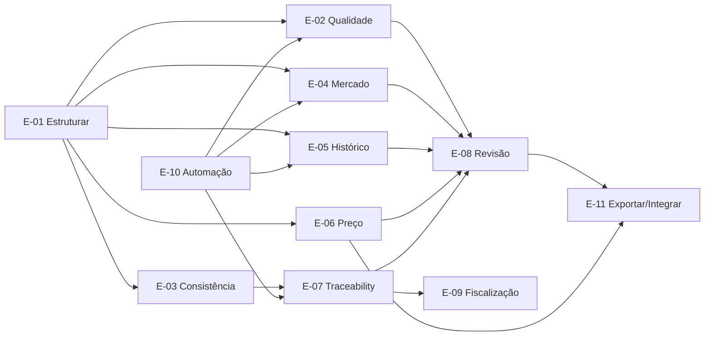

# User Stories — TR Intelligence Platform

Formato:

`US-XXX — Como <perfil>, quero <ação>, para <resultado>.`

Cada história referencia as features (`F-*`) e requisitos (`FR-*`) correspondentes.

## Premissas transversais de aceite

- O perfil único atual é `PUBLICO_14133_PREGAO_ELETRONICO_BENS`: órgão ou entidade federal, estadual, distrital ou municipal, Lei 14.133/2021, **Pregão Eletrônico** (`PE`, nunca Pernambuco) e aquisição de bens comuns.
- FR-006 é porta obrigatória: somente workspace `SUPPORTED` pode alimentar o corpus aprovado, denominadores, comparáveis e engines F-03–F-14. Material `OUT_OF_SCOPE` pode permanecer em trilha de rejeição/auditoria, mas não participa dessas entradas, contagens ou conclusões.
- Toda história que consulta, lista ou analisa dados aplica e exibe os filtros de esfera, perfil e estado de escopo. Toda exportação registra perfil ativo, filtros, versões e exclusões; não promove material fora do perfil a evidência aprovada.
- O arquivo original é imutável e possui hash obrigatório calculado sobre seus bytes. OCR é apenas derivado auditável, vinculado ao original e identificado por motor, idioma, confiança e hash ou versão do resultado; nunca altera o original.
- Valores, comparações e findings precisam apontar evidência navegável. A ferramenta apoia decisão humana, não certifica legalidade nem substitui decisão administrativa, técnica, jurídica ou de controle.
- Para conclusões normativas deste perfil, a base vinculante é a Lei 14.133/2021. IN SEGES/ME nº 81 e modelos AGU/TR Digital são `REFERENCE_ONLY`: podem apoiar revisão humana, mas não determinar escopo nem, isoladamente, gerar conclusão ou finding normativo.
- As histórias dos engines descrevem o produto-alvo e ficam limitadas a documentos ativos/utilizáveis de workspaces `SUPPORTED`; só são oferecidas após a implementação e o aceite do milestone correspondente em `04_TRACEABILITY_MATRIX.md`.

---

## Epic E-01 — Criar e entender a contratação

### US-001 — Abrir contratação
**Como** P-02 Planejamento
**quero** criar um workspace para uma nova contratação  
**para** manter documentos, requisitos, decisões e análises em um único local.

**Features:** F-01  
**Reqs:** FR-001

**Aceite**
- workspace recebe ID;
- responsável é registrado;
- são registrados CNPJ e identificação do órgão/entidade, esfera, regime legal, modalidade, forma, natureza do objeto e perfil;
- o status inicial `DRAFT` e o estado de escopo inicial `SCOPE_VALIDATION` são visíveis;
- nenhuma engine é habilitada antes da decisão de US-004/FR-006.

### US-002 — Importar processo existente
**Como** P-02  
**quero** enviar ETP e TR já existentes  
**para** começar a análise sem redigitar dados.

**Features:** F-02  
**Reqs:** FR-002–004

**Aceite**
- cada original é preservado, versionado e identificado por hash calculado sobre o próprio arquivo;
- parsing falho é explícito;
- quando necessário, OCR produz derivado separado e auditável com motor, idioma, confiança e hash ou versão do resultado;
- reprocessar parsing/OCR não sobrescreve o original nem rompe sua proveniência.

### US-003 — Confirmar extração
**Como** P-02  
**quero** revisar os requisitos extraídos e corrigir erros  
**para** impedir que análises posteriores usem informação errada.

**Features:** F-03, F-04  
**Reqs:** FR-010–014

**Aceite**
- cada valor extraído abre documento, página/seção, bloco e trecho que o sustentam;
- o usuário pode confirmar, editar ou rejeitar, mantendo valor original, responsável e timestamp;
- nenhum valor sem evidência pode tornar-se `CONFIRMED` ou alimentar engine downstream.

### US-004 — Validar escopo da contratação
**Como** P-02 Planejamento
**quero** validar o perfil da contratação antes do processamento  
**para** impedir que material fora do perfil contamine análises e métricas.

**Features:** F-01  
**Reqs:** FR-006

**Aceite**
- a decisão usa cumulativamente esfera conhecida (`F`/`E`/`D`/`M`), Lei 14.133/2021, modalidade pregão, forma eletrônica e aquisição de bens comuns;
- `SUPPORTED` libera a ingestão e os engines conforme sua disponibilidade;
- `OUT_OF_SCOPE` registra motivo e evidência na trilha de rejeição/auditoria, sem entrar no corpus aprovado, denominadores, comparáveis ou engines;
- canal de origem, inclusive PNCP ou Compras.gov, não determina a esfera;
- a decisão de escopo é auditável e pode ser revista por pessoa autorizada sem apagar o histórico.

---

## Epic E-02 — Revisar qualidade do TR [B]

### US-010 — Encontrar requisito vago
**Como** P-02  
**quero** receber alerta para expressões subjetivas  
**para** tornar o requisito verificável antes da publicação.

**Features:** F-05  
**Reqs:** FR-021, FR-022, FR-027

### US-011 — Encontrar contradição interna
**Como** P-02  
**quero** saber quando o mesmo TR apresenta dois valores diferentes  
**para** corrigir o documento antes de encaminhá-lo.

**Features:** F-05  
**Reqs:** FR-023

### US-012 — Ver obrigação sem medição
**Como** P-04 Jurídico/Controle  
**quero** saber quando uma obrigação não possui critério de aceitação  
**para** reduzir risco de execução impossível de fiscalizar.

**Features:** F-05, F-10  
**Reqs:** FR-024, FR-074

### US-013 — Resolver finding
**Como** P-02  
**quero** marcar um finding como resolvido e registrar o motivo  
**para** preservar a decisão no histórico.

**Features:** F-11, F-12  
**Reqs:** FR-081–084

---

## Epic E-03 — Manter consistência entre documentos [C]

### US-020 — ETP ↔ TR
**Como** P-02  
**quero** comparar automaticamente ETP e TR  
**para** detectar alteração não justificada.

**Features:** F-06  
**Reqs:** FR-030, FR-034, FR-035

### US-021 — TR ↔ Edital
**Como** P-03 Compras  
**quero** comparar edital contra TR aprovado  
**para** não introduzir divergências na publicação.

**Features:** F-06, F-10  
**Reqs:** FR-031

### US-022 — Edital ↔ Contrato
**Como** P-03  
**quero** verificar se a minuta/contrato manteve as condições relevantes  
**para** impedir perda de obrigação após a disputa.

**Features:** F-06  
**Reqs:** FR-032, FR-033

### US-023 — Justificar alteração
**Como** P-02  
**quero** marcar uma divergência como intencional e justificar  
**para** distinguir mudança legítima de erro.

**Features:** F-06, F-12  
**Reqs:** FR-034, FR-083

### US-024 — DFD ↔ ETP
**Como** P-01 Área requisitante  
**quero** comparar o DFD com o ETP quando ambos existirem  
**para** ver se a necessidade formalizada foi preservada.

**Features:** F-06  
**Reqs:** FR-036

---

## Epic E-04 — Validar mercado [A]

### US-030 — Ver produtos compatíveis
**Como** P-02  
**quero** descobrir quantos produtos atendem minha especificação  
**para** avaliar se ela representa o mercado.

**Features:** F-07  
**Reqs:** FR-040–043

**Aceite adicional:** candidatos e contagens exibem os filtros municipais e de escopo aplicados; registros fora do perfil não entram no denominador.

### US-031 — Descobrir requisito restritivo
**Como** P-02  
**quero** saber quais requisitos mais reduzem a quantidade de candidatos  
**para** revisar apenas aqueles que merecem investigação.

**Features:** F-07  
**Reqs:** FR-044–046

### US-032 — Inspecionar evidência
**Como** P-02  
**quero** abrir a fonte usada para classificar um produto como compatível/incompatível  
**para** validar a conclusão.

**Features:** F-07  
**Reqs:** FR-045

---

## Epic E-05 — Entender histórico [D]

### US-040 — Detectar reaproveitamento
**Como** P-02  
**quero** saber se a descrição atual é semelhante a licitações anteriores  
**para** entender de onde ela veio.

**Features:** F-08  
**Reqs:** FR-050–052

### US-041 — Detectar obsolescência
**Como** P-02  
**quero** comparar uma especificação antiga com o mercado atual  
**para** evitar perpetuar requisitos que perderam aderência.

**Features:** F-08, F-07  
**Reqs:** FR-053–055

**Aceite adicional:** séries histórica e de mercado usam somente registros `SUPPORTED` pelo perfil ativo e tornam filtros e exclusões auditáveis.

### US-042 — Ver linhagem
**Como** P-04  
**quero** visualizar a cadeia provável de reutilização  
**para** entender quando e onde um requisito foi introduzido.

**Features:** F-08, F-10  
**Reqs:** FR-052, FR-070

---

## Epic E-06 — Pesquisa de preços [A]

### US-050 — Encontrar preços comparáveis
**Como** P-02  
**quero** localizar aquisições equivalentes  
**para** reduzir pesquisa manual.

**Features:** F-09  
**Reqs:** FR-060–061

**Aceite adicional:** origem em PNCP/Compras.gov não basta; cada comparável precisa passar pelos filtros municipais e demais critérios do perfil.

### US-051 — Ver outliers
**Como** P-02  
**quero** identificar valores anormais  
**para** não contaminar a estimativa.

**Features:** F-09  
**Reqs:** FR-062

### US-052 — Exportar memória
**Como** P-02  
**quero** gerar memória de cálculo auditável  
**para** anexar ao processo.

**Features:** F-09, F-15  
**Reqs:** FR-063–064, FR-110

**Aceite adicional:** a memória exportada identifica perfil, filtros, amostra aceita/rejeitada, exclusões, fontes e versões de cálculo.

---

## Epic E-07 — Rastreabilidade [C]

### US-060 — Seguir um requisito
**Como** P-04  
**quero** clicar em um requisito e ver sua trajetória  
**para** entender sua origem e alterações.

**Features:** F-10  
**Reqs:** FR-070–073

### US-061 — Detectar requisito perdido
**Como** P-03  
**quero** saber se uma obrigação do TR desapareceu do contrato  
**para** corrigir antes da assinatura.

**Features:** F-10  
**Reqs:** FR-072

### US-062 — Ver cobertura de fiscalização
**Como** P-05 Fiscal  
**quero** saber quais obrigações precisam ser verificadas  
**para** garantir que o contrato seja fiscalizável.

**Features:** F-10, F-13  
**Reqs:** FR-074, FR-090

---

## Epic E-08 — Revisão e decisão

### US-070 — Dashboard de risco
**Como** P-04  
**quero** ver findings agrupados por severidade e categoria  
**para** priorizar minha revisão.

**Features:** F-11  
**Reqs:** FR-080

### US-071 — Aceitar risco
**Como** P-04  
**quero** aceitar conscientemente um finding e justificar  
**para** não forçar correções automáticas.

**Features:** F-12  
**Reqs:** FR-081–083

### US-072 — Reprocessar
**Como** P-02  
**quero** atualizar o documento e executar novamente as análises  
**para** confirmar que os problemas foram corrigidos.

**Features:** F-02, F-11  
**Reqs:** FR-084

---

## Epic E-09 — Fiscalização

### US-080 — Gerar checklist
**Como** P-05  
**quero** gerar checklist a partir do contrato  
**para** verificar entrega sem reler o processo inteiro.

**Features:** F-13  
**Reqs:** FR-090

### US-081 — Registrar evidência
**Como** P-05  
**quero** anexar evidência ao item verificado  
**para** deixar registro da fiscalização.

**Features:** F-13  
**Reqs:** FR-091

### US-082 — Registrar não conformidade
**Como** P-05  
**quero** marcar requisito não cumprido  
**para** vinculá-lo à obrigação contratual correspondente.

**Features:** F-13  
**Reqs:** FR-092–093

---

## Epic E-10 — Automação inteligente

### US-090 — Investigação automática
**Como** P-02  
**quero** pedir “verificar mercado” sem escolher agentes internos  
**para** receber uma conclusão pronta com evidências.

**Features:** F-14  
**Reqs:** FR-100–105

### US-091 — Confiar no resultado
**Como** P-04  
**quero** que findings semânticos apontem evidências concretas  
**para** não depender de uma conclusão opaca de LLM.

**Features:** F-11, F-14  
**Reqs:** FR-101, FR-105

**Aceite adicional:** toda conclusão abre a evidência e identifica perfil, filtros, versão e tipo da fonte; `REFERENCE_ONLY` não sustenta conclusão normativa.

---

## Epic E-11 — Exportar e integrar

### US-100 — Exportar processo
**Como** P-02  
**quero** baixar o workspace em JSON, PDF ou DOCX  
**para** anexar evidências e findings ao processo eletrônico.

**Features:** F-15  
**Reqs:** FR-110

**Aceite adicional:** o pacote exportado registra perfil e estado de escopo, filtros, exclusões, hashes dos originais, versões dos derivados e decisões humanas; conteúdo `OUT_OF_SCOPE`, se incluído para auditoria, permanece segregado e rotulado.

### US-101 — Integrar sistemas institucionais
**Como** P-06 Administrador  
**quero** conectar processo eletrônico, compras e PNCP quando disponíveis  
**para** não retrabalhar upload/download manual.

**Features:** F-15  
**Reqs:** FR-111

**Aceite adicional:** importar de integração não implica `SUPPORTED`; FR-006 e os filtros municipais continuam obrigatórios antes de qualquer uso downstream.

---

# Relação entre epics

