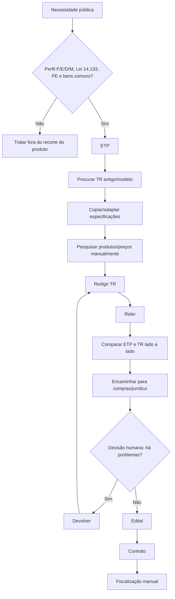
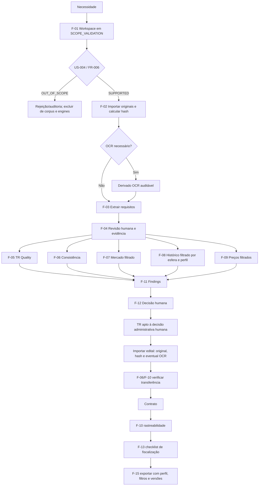
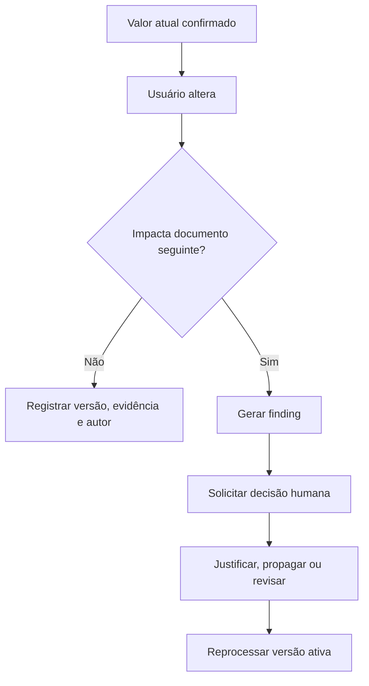

# Usage Flows — TR Intelligence Platform

Este arquivo descreve **como o produto é usado no cotidiano**, do ponto de vista do servidor público.

Referências:
- features: `F-*` em `00_PRODUCT_SPEC.md`
- requisitos: `FR-*` em `01_REQUIREMENTS.md`
- histórias: `US-*` em `02_USER_STORIES.md`

## Preâmbulo transversal aos fluxos 1–14

- O perfil único atual é `PUBLICO_14133_PREGAO_ELETRONICO_BENS`: órgão ou entidade federal, estadual, distrital ou municipal, Lei 14.133/2021, **Pregão Eletrônico** (`PE`, nunca Pernambuco) e aquisição de bens comuns.
- Nos fluxos executados pela plataforma, FR-006 é a primeira porta de domínio. Apenas processo `SUPPORTED` alimenta corpus aprovado, denominadores, comparáveis e engines. Processo `OUT_OF_SCOPE` pode ser preservado na trilha de rejeição/auditoria, com motivo e evidência, mas é excluído desses usos.
- Toda busca, painel, contagem e exportação exibe e conserva os filtros de esfera, perfil e estado de escopo. PNCP e Compras.gov são canais: não enquadram um processo no perfil por si sós.
- Em cada importação, o hash obrigatório cobre o arquivo original imutável. Se houver OCR, o texto é derivado auditável ligado ao original, com motor, idioma, confiança e hash ou versão do resultado; reprocessamento nunca altera o original.
- Engines operam somente sobre documentos ativos/utilizáveis e dados confirmados. Toda conclusão abre sua evidência e termina em decisão humana registrada; a plataforma não certifica legalidade nem substitui decisão administrativa, técnica, jurídica ou de controle.
- A base normativa vinculante deste perfil é a Lei 14.133/2021. IN SEGES/ME nº 81 e modelos AGU/TR Digital são `REFERENCE_ONLY` e não determinam escopo nem sustentam, isoladamente, finding normativo.
- Estes são fluxos do produto completo. Uma ação de UI permanece **indisponível** até o aceite de seu milestone M0–M6 em `04_TRACEABILITY_MATRIX.md`; o gate do corpus R1, sozinho, não implementa workspace, UI ou engine. Fluxos compostos são liberados por etapas, sem simular resultado de feature futura.

---

# 1. Fluxo atual — sem a ferramenta

**Atores:** P-01 Área requisitante municipal, P-02 Planejamento municipal, P-03 Compras/Licitações municipal, P-04 Jurídico/Controle interno municipal e P-05 Fiscal municipal  
**Disponibilidade:** fluxo manual existente; não representa feature implementada nem certificação legal.



Principais trabalhos mecânicos:
- validar manualmente o recorte de esfera e perfil;
- procurar documentos antigos;
- copiar requisitos;
- pesquisar produto por produto;
- comparar PDFs;
- conferir valores repetidos;
- rastrear de onde veio uma cláusula;
- reler documentos após alterações.

---

# 2. Fluxo completo — com a ferramenta

**Atores:** P-01–P-05 municipais; P-06 Administrador municipal nas configurações e integrações  
**Stories:** US-001–US-101, conforme cada etapa  
**Features:** F-01–F-15  
**Disponibilidade:** visão-alvo liberada por milestones; etapas futuras ficam ocultas ou desabilitadas até seu aceite.



---

# 3. Fluxo diário A — Iniciar uma contratação

**Ator:** P-02 Planejamento da contratação municipal  
**Stories:** US-001, US-002, US-003, US-004  
**Features:** F-01–F-04  
**Disponibilidade:** M0; indisponível como fluxo de produto antes do aceite de R6.

1. Usuário clica `Nova contratação`.
2. Informa CNPJ e identificação do órgão/entidade, unidade, objeto, responsável, esfera, regime legal, modalidade, forma, natureza do objeto e perfil.
3. Workspace nasce com status `DRAFT` e estado de escopo `SCOPE_VALIDATION`; FR-006 verifica cumulativamente esfera conhecida (`F`/`E`/`D`/`M`), Lei 14.133/2021, pregão, forma eletrônica e bens comuns.
4. Pessoa autorizada confirma a decisão e sua evidência:
   - `OUT_OF_SCOPE`: registra motivo na trilha de rejeição/auditoria e bloqueia corpus aprovado, denominadores, comparáveis e engines;
   - `SUPPORTED`: prossegue.
5. Faz upload dos documentos disponíveis. Para novas entradas do corpus R1, o
   contrato deve apontar para a contratação vinculada e essa contratação deve
   ter exatamente um ETP, um TR, um Edital e um instrumento contratual
   ativos/utilizáveis; isso não impede versionamento no produto em uso.
6. F-02 preserva cada original, calcula seu hash, registra versão e classifica o documento.
7. Se necessário, F-02 gera OCR separado com motor, idioma, confiança e hash ou versão; falha de parsing/OCR é explícita.
8. F-03 extrai itens, quantidades, requisitos, prazos, garantias e critérios, sempre com documento, página/seção, bloco e trecho.
9. F-04 abre `Revisar extração`; usuário confirma, edita ou rejeita, mantendo original, autoria e timestamp.
10. Somente o último dado `CONFIRMED`, com evidência, vira baseline e pode alimentar features já disponíveis.

**Resultado:** contratação municipal suportada possui estado estruturado inicial; rejeições permanecem segregadas e auditáveis.

---

# 4. Fluxo diário B — Elaborar/revisar TR

**Atores:** P-02 Planejamento municipal e P-04 Jurídico/Controle interno municipal  
**Stories:** US-010–013, US-020, US-023, US-072  
**Features:** F-02, F-05, F-06, F-11, F-12  
**Disponibilidade:** M1; controles permanecem indisponíveis antes do aceite de R10.

1. Sistema reconfirma que o workspace está `SUPPORTED` e usa somente os quatro
   elos da cadeia (ETP, TR, Edital e contrato) ativos, utilizáveis e
   confirmados. Processos históricos que ainda só têm ETP/TR permanecem
   identificados como históricos até serem promovidos.
2. Usuário envia versão atual do TR; F-02 preserva original, calcula hash e registra eventual OCR como derivado auditável.
3. F-03/F-04 extraem e submetem os requisitos à confirmação humana.
4. F-06 compara o TR com o baseline confirmado do ETP.
5. F-05 executa completude, ambiguidade, mensurabilidade, contradição, aceitação e referências conforme o perfil ativo.
6. F-11 consolida findings com perfil, regra, tipo de fonte, versão, confiança e evidência navegável. `REFERENCE_ONLY` não produz obrigação normativa.
7. Painel, filtrado para o workspace suportado, mostra:

```text
HIGH     3
MEDIUM   7
INFO     12
```

8. Usuário abre um finding:

```text
Garantia divergente

ETP §7.4: 36 meses
TR §5.8: 12 meses

[Corrigir TR]
[Alteração intencional]
[Falso positivo]
```

9. Usuário corrige, justifica, aceita risco ou marca falso positivo conforme autorização.
10. Ao reprocessar, a nova versão recebe novo hash do original e não sobrescreve versões anteriores; F-02/F-11 recalculam e preservam o histórico.

**Critério de saída:** nenhum `HIGH` aberto, ou todos os `HIGH` restantes explicitamente aceitos por usuário autorizado. Isso registra decisão, não certificação legal.

---

# 5. Fluxo diário C — Validar mercado

**Atores:** P-02 Planejamento municipal e P-04 Jurídico/Controle interno municipal  
**Stories:** US-030–032, US-041  
**Features:** F-07, F-14  
**Disponibilidade:** M2; ação `Verificar mercado` indisponível antes do aceite desse milestone.

Ação da UI: `Verificar mercado`.

Antes de executar, o sistema exige workspace `SUPPORTED`, requisitos confirmados e filtros visíveis de esfera, perfil e escopo. Fonte PNCP/Compras.gov não dispensa a validação de cada registro.


Saída por item:

```text
ITEM-004 — Notebook
Perfil: PUBLICO_14133_PREGAO_ELETRONICO_BENS
Candidatos analisados no filtro: 143
Compatíveis: 2

Requisito             Passam    Impacto
RAM >= 16GB           116       baixo
SSD >= 512GB          131       baixo
Peso <= 1,3kg          18       alto
Bateria >= 70Wh        11       alto
Todos                   2       crítico
```

`UNKNOWN` não conta como incompatível sem evidência. Usuário abre fonte, revisa filtros e decide manter, justificar ou ajustar o requisito; a decisão fica auditada.

---

# 6. Fluxo diário D — Investigar reutilização/obsolescência

**Atores:** P-02 Planejamento municipal e P-04 Jurídico/Controle interno municipal  
**Stories:** US-040–042  
**Features:** F-07, F-08, F-10, F-14  
**Disponibilidade:** M3, com dependências de M2/M4; cada controle fica indisponível até o respectivo milestone.

1. Ação `Ver histórico da especificação` exige workspace `SUPPORTED` e requisito confirmado.
2. Sistema normaliza requisitos atuais, busca somente processos históricos `SUPPORTED` no perfil multiesfera, calcula similaridade e identifica possíveis ancestrais.
3. Séries e denominadores excluem `OUT_OF_SCOPE`; UI exibe filtros, exclusões, fontes e evidências.
4. Quando F-10 estiver disponível, o usuário abre a linhagem do requisito.

```text
Possível linhagem — universo filtrado por esfera e perfil

2022 — Pregão Eletrônico 041/2022 — 96%
  ↓
2024 — Pregão Eletrônico 017/2024 — 98%
  ↓
2025 — Pregão Eletrônico 033/2025 — 99%
  ↓
Atual
```

Usuário decide manter, revisar requisito específico ou documentar justificativa de continuidade. Similaridade é indício auditável, não prova automática de cópia ou ilegalidade.

---

# 7. Fluxo diário E — Pesquisa de preços

**Ator:** P-02 Planejamento da contratação municipal  
**Stories:** US-050–052  
**Features:** F-09, F-15  
**Disponibilidade:** análise em M3; exportação institucional F-15 em M6. O botão correspondente fica indisponível antes de cada aceite.

1. Usuário escolhe item confirmado de workspace `SUPPORTED`.
2. Sistema busca contratações comparáveis e aceita somente registros validados como municipais e aderentes aos demais critérios do perfil.
3. Resolve equivalência, normaliza unidade/data e apresenta amostra com filtros e exclusões.

```text
Amostra válida no filtro: 17
Mediana: R$ 4.120
Média:   R$ 4.265
Min:     R$ 3.780
Max:     R$ 5.050
Outliers sugeridos: 2
```

4. Usuário abre evidências e aceita/rejeita comparáveis; sistema recalcula sem tratar sugestão como decisão automática.
5. Com F-15 disponível, exporta memória com perfil, filtros municipais, amostra, exclusões, fontes, versões e responsável pela decisão.

---

# 8. Fluxo diário F — Preparar para jurídico/controle

**Atores:** P-02 Planejamento municipal → P-04 Jurídico/Controle interno municipal  
**Stories:** US-070–072  
**Features:** F-02, F-11, F-12  
**Disponibilidade:** M1; análises de M2–M4 aparecem como `INDISPONÍVEL`, nunca como aprovadas.

Tela `Pré-flight`, limitada ao workspace `SUPPORTED` e aos documentos ativos/utilizáveis:

```text
Estrutura do TR          ✓
ETP ↔ TR                 ✓
Mercado                  INDISPONÍVEL até M2
Histórico                INDISPONÍVEL até M3
Preço                    INDISPONÍVEL até M3
Rastreabilidade          INDISPONÍVEL até M4

HIGH    0
MEDIUM  3
INFO    11
```

Cada finding informa o que, por que, evidência, perfil/regra/fonte, decisão e responsável. P-04 pode comentar, reabrir, aceitar risco ou solicitar correção. No reprocessamento, F-02 preserva/hash-eia a nova versão e F-11 recompõe findings sem apagar a decisão anterior. Exportações futuras mantêm filtros e exclusões.

---

# 9. Fluxo diário G — Edital

**Atores:** P-03 Compras/Licitações municipal e P-04 Jurídico/Controle interno municipal  
**Stories:** US-021  
**Features:** F-02, F-03, F-04, F-06, F-10  
**Disponibilidade:** importação/revisão em M0, consistência em M1 e rastreabilidade em M4; controles futuros ficam indisponíveis.

1. Em workspace `SUPPORTED`, edital é importado; original recebe hash e eventual OCR é derivado auditável.
2. F-03 extrai obrigações/requisitos com evidência e F-04 exige confirmação humana.
3. F-06 compara TR ↔ edital usando apenas versões ativas/utilizáveis.
4. Quando disponível, F-10 mostra cobertura:

| Requisito | ETP | TR | Edital |
|---|---|---|---|
| Quantidade 400 | ✓ | ✓ | ✓ |
| Garantia 36m | ✓ | ✓ | ✓ |
| Entrega 30d | ✓ | ✓ | **45d ⚠** |

P-03/P-04 abre a evidência e corrige ou justifica. Nenhum resultado é aprovação automática do edital.

---

# 10. Fluxo diário H — Contrato

**Atores:** P-03 Compras/Licitações municipal e P-04 Jurídico/Controle interno municipal  
**Stories:** US-022, US-060, US-061  
**Features:** F-02, F-03, F-04, F-06, F-10, F-11, F-12  
**Disponibilidade:** ingestão M0, finding/decisão M1 e rastreabilidade M4; o que ainda não foi aceito permanece indisponível.

1. Em workspace `SUPPORTED`, minuta/contrato é importado com preservação do original, hash e eventual OCR derivado.
2. Extrações com evidência passam por confirmação humana.
3. Sistema compara TR ↔ contrato e edital ↔ contrato somente entre documentos ativos/utilizáveis.
4. F-10, quando disponível, constrói:

```text
REQ-042 — Garantia 36 meses

ETP       ✓ §7.4
TR        ✓ §5.8
Edital    ✓ §9.2
Contrato  ✗ 24 meses
```

5. F-11 pode gerar `HIGH`; usuário abre as fontes e corrige, justifica ou aceita explicitamente conforme autorização. Filtros e decisões acompanham eventual exportação.

---

# 11. Fluxo diário I — Fiscalização

**Atores:** P-05 Gestor/Fiscal municipal de contrato e P-04 Jurídico/Controle interno municipal  
**Stories:** US-062, US-080–082  
**Features:** F-10, F-13  
**Disponibilidade:** rastreabilidade em M4 e fiscalização em M5; checklist fica indisponível antes de M5.

1. Sistema exige workspace `SUPPORTED` e lê somente requisitos contratuais confirmados de contrato ativo/utilizável.
2. F-10 verifica cobertura e F-13 gera checklist agrupado por entrega, instalação, aceite, garantia, SLA e pagamento.

```text
Lote 1 — Recebimento

[ ] 400 unidades entregues
[ ] RAM >= 16 GB
[ ] SSD >= 512 GB
[ ] Garantia >= 36 meses
[ ] Entrega dentro de 30 dias
```

3. Fiscal abre `Contrato → Edital → TR → ETP`, marca conforme/não conforme, anexa evidência e registra observação.
4. Filtro do perfil e vínculo à obrigação acompanham tela e exportação; pessoa responsável decide o encaminhamento da não conformidade.

---

# 12. Fluxo de alteração de requisito

**Atores:** P-01–P-05 municipais, conforme etapa e autorização  
**Stories:** US-003, US-013, US-023, US-071, US-072  
**Features:** F-02, F-04, F-06, F-11, F-12  
**Disponibilidade:** versionamento/confirmação em M0 e workflow completo em M1; ações futuras ficam indisponíveis.

O fluxo só opera em workspace `SUPPORTED`; mudança de documento preserva o novo original com seu hash e eventual OCR derivado, sem sobrescrever a versão anterior.



Nenhuma alteração sobrescreve silenciosamente o histórico. Material fora do perfil continua segregado, e eventual exportação registra perfil, filtros, versões e decisões.

---

# 13. Fluxo do pipeline inteligente

**Atores:** P-02 Planejamento municipal e P-04 Jurídico/Controle interno municipal; P-06 Administrador municipal configura ferramentas  
**Stories:** US-090, US-091  
**Features:** F-14 e engine de domínio acionada  
**Disponibilidade:** F-14 parcial em M2 e ampliada pelos milestones seguintes; ação dependente de engine não aceita permanece indisponível.

1. UI oferece ação de domínio (`Analisar requisito`, `Verificar mercado`) apenas em workspace `SUPPORTED`, com entrada confirmada e engine disponível.
2. Orquestrador propaga filtros de esfera/perfil para busca e tools, bloqueando
   `OUT_OF_SCOPE` de corpus, denominadores e conclusão.
3. Toda saída retorna estrutura, versões, filtros e evidência; fonte `REFERENCE_ONLY` não fundamenta conclusão normativa.
4. Usuário revisa e decide aceitar, rejeitar ou solicitar nova investigação. Nenhum agente publica decisão ou certificação legal autonomamente.

Regras de determinístico / LLM / agente: `00_PRODUCT_SPEC.md` F-14.

---

# 14. Fluxo de sucesso completo

**Atores:** P-01–P-05 municipais; P-06 Administrador municipal nas integrações  
**Stories:** conjunto aplicável de US-001–US-101  
**Features:** F-01–F-15  
**Disponibilidade:** happy path alvo, construído na ordem M0–M6; em cada momento, só etapas de milestones aceitos ficam habilitadas.

1. Criar workspace e obter decisão humana `SUPPORTED` em FR-006.
2. Importar os documentos da cadeia (ETP, TR, Edital e contrato), preservar
   originais, calcular hashes e registrar eventual OCR derivado auditável.
3. Extrair com evidência e confirmar humanamente.
4. Executar somente engines disponíveis sobre dados confirmados e universo filtrado por esfera e perfil.
5. Revisar findings e registrar correções, justificativas, riscos aceitos ou falsos positivos.
6. Repetir importação, hash/OCR, confirmação e comparação para edital e contrato.
7. Rastrear obrigações e fiscalizar, quando M4/M5 estiverem disponíveis.
8. Exportar, quando M6 estiver disponível, com perfil, filtros, exclusões, hashes, versões, evidências e decisões.

Qualquer falha de escopo encerra o happy path de análise e segue para rejeição/auditoria. O ciclo segue `00` §1 e a ordem de construção de `04`; completar o fluxo significa preservar rastreabilidade e decisão humana, não emitir certificação legal.
